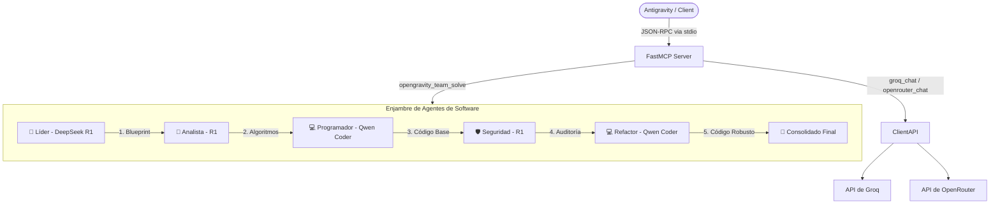

# 🌌 OpenGravity MCP Server — Multi-Agent Software Engineering Gateway

[](LICENSE)
[](pyproject.toml)
[](https://modelcontextprotocol.io)

Servidor **Model Context Protocol (MCP)** independiente y modular que actúa como pasarela avanzada hacia los LLMs de **Groq** y **OpenRouter**, implementando un enjambre orquestado de agentes de desarrollo de software bajo principios de **Vibe-Coding Profesional**.

---

## 🏗️ Arquitectura del Sistema

El servidor expone herramientas para consultar modelos individuales o invocar un debate multi-agente iterativo de software que valida la arquitectura, algoritmos, codificación y seguridad lógica de la aplicación.



---

## 👥 Agentes Especializados del Enjambre

El sistema cuenta con un registro dinámico de agentes de software:
*   **📐 Líder de Arquitectura (`architect`):** Planificación previa, APIs, esquemas y estructura de módulos.
*   **🧮 Analista de Algoritmos (`analyst`):** Diseño algorítmico, lógica matemática y prevención de desbordamientos y divisiones por cero.
*   **💻 Desarrollador de Software (`coder`):** Escritura de código modular, DRY, SOLID y libre de dependencias innecesarias.
*   **🛡️ Analista de Seguridad y Robustez (`security`):** OWASP Top 10, timeouts, sanitización de inputs y manejo seguro de excepciones (Failsafe).
*   **🔍 Validador de Calidad y QA (`validator`):** Verificación de sintaxis, reglas de estilo (linters) y planes de pruebas en 3 escenarios.

---

## 🌊 Principios de Vibe-Coding Profesional

El servidor fuerza (vía prompts de sistema y post-procesamiento automatizado) el cumplimiento del manifiesto de **Vibe-Coding Profesional**:
1.  **Blueprint Primero:** No se codifica sin un plan aprobado.
2.  **Solución Causa Raíz:** Prohibición de parches rápidos o "workarounds".
3.  **Disciplina del Stack:** Mantener el stack tecnológico limpio y sin dependencias fantasma.
4.  **Auto-Documentación:** Comentarios de alto nivel explicando el porqué lógico.
5.  **Validación 3 Pasos:** Sintaxis, lógica de seguridad y plan de pruebas (Normal, Crítico, Fallo).
6.  **Contención:** Reversión y parada del agente tras 3 fallos consecutivos del compilador.

---

## 🛠️ Instalación y Configuración

### 1. Clonar el repositorio
```bash
git clone https://github.com/tu-usuario/opengravity-mcp.git
cd opengravity-mcp
```

### 2. Configurar variables de entorno
Copia el archivo de plantilla `.env.example` a `.env` y rellena con tus claves API:
```bash
cp .env.example .env
```
Edita `.env`:
```ini
GROQ_API_KEY=gsk_your_groq_key_here
OPENROUTER_API_KEY=sk-or-v1-your_openrouter_key_here
```

### 3. Instalación de dependencias
Puedes instalar el paquete utilizando **pip** o el gestor de alta velocidad **uv**:

**Con uv (Recomendado):**
```bash
uv pip install -e .
```

**Con pip:**
```bash
pip install -e .
```

---

## 🚀 Uso del Servidor MCP

Para iniciar el servidor localmente en modo stdio (para pruebas de depuración):
```bash
python -m opengravity.server
```

### Integración en IDEs (Antigravity / Cursor / Claude Desktop)

Agrega la configuración en el archivo `mcp_config.json` de tu cliente:

```json
{
  "mcpServers": {
    "opengravity-mcp": {
      "command": "python",
      "args": [
        "-m",
        "opengravity.server"
      ],
      "env": {
        "PYTHONPATH": "c:/Users/Cfg Oxbeel/Documents/Equipo/opengravity-mcp/src"
      }
    }
  }
}
```

---

## 🔧 Herramientas Expuestas (MCP Tools)

*   `groq_chat(prompt, model, system_prompt, temperature, max_tokens)` — Envia un prompt a la API de Groq.
*   `openrouter_chat(prompt, model, system_prompt, temperature, max_tokens)` — Envía un prompt a la API de OpenRouter.
*   `groq_list_models(search)` — Lista y filtra modelos activos en Groq.
*   `openrouter_list_models(search, limit)` — Lista y filtra modelos en OpenRouter.
*   `opengravity_orchestrate(task_description, role, category)` — Orquesta un agente para resolver una tarea simple seleccionando el modelo óptimo.
*   `opengravity_team_solve(task_description)` — Ejecuta el enjambre de software multi-agente completo (Debate iterativo).
*   `opengravity_list_agents()` — Muestra los perfiles de agentes registrados.
*   `opengravity_agent_solve(role_id, task_description, category)` — Ejecuta un agente específico.

---

## 📄 Licencia

Este proyecto está bajo la Licencia MIT. Consulta el archivo [LICENSE](LICENSE) para más detalles.
