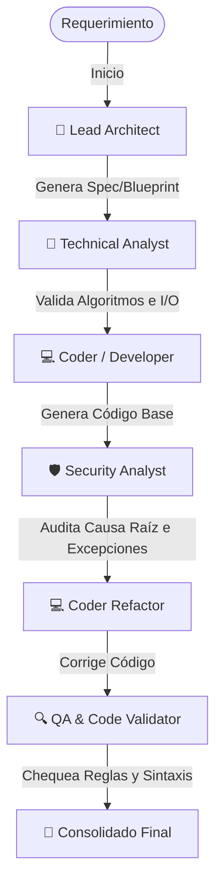

# 🧠 Base de Conocimiento: Vibe-Coding Profesional & Ecosistema Gentleman Programming
===================================================================================

Este documento sintetiza la filosofía, flujos de trabajo y mejores prácticas de **Vibe-Coding Profesional** inspiradas en el ecosistema de **Gentleman Programming (Alan Buscaglia)**. Define el marco operativo para la interacción de agentes de IA, servidores MCP, memoria persistente y desarrollo guiado por especificaciones.

---

## 📐 1. Spec-Driven Development (SDD)

El **Spec-Driven Development (SDD)** es el pilar fundamental para evitar el "doom loop" (bucles infinitos de corrección de errores de la IA) y la degradación del código.

### Principios del SDD:
*   **La Espec como Fuente Única de Verdad (Single Source of Truth):** Ningún agente escribe código sin un archivo de especificación previo (`SPEC.md` o blueprint).
*   **Definición de Límites y Tipos:** La especificación debe definir con precisión:
    *   Tipos de datos y interfaces de API.
    *   Límites de entrada del sistema y sanitizaciones requeridas.
    *   Manejo de errores y flujos de recuperación segura.
*   **Reducción del Espacio de Búsqueda:** Al proveer una especificación delimitada, el programador de IA (`coder`) reduce los tokens perdidos en supuestos incorrectos, generando código deterministicamente correcto.

---

## 💾 2. Memoria Persistente (Engram)

Los agentes de IA por defecto no recuerdan interacciones anteriores una vez finalizada la sesión. Para evitar que repitan errores o violen decisiones de diseño tomadas previamente, se implementa la arquitectura de **Engram (Memoria Persistente)**.

### Implementación del Engram:
*   **Registro de Aprendizajes (`memoria/aprendizajes.md`):** Al resolver un bug complejo, el agente debe documentar la causa raíz y la solución técnica.
*   **Reglas de Estilo Persistentes:** Ejemplo: *"Asegurar el uso de tipado estricto en Python usando la librería typing."* Este engrama es cargado por el orquestador como una restricción de sistema antes de cada llamada de generación de código.
*   **Contexto de Diseño Histórico:** Guarda decisiones arquitectónicas para guiar futuras ampliaciones.

---

## 🔌 3. Agentes de IA y el Model Context Protocol (MCP)

En la ingeniería agéntica moderna, los LLMs no solo piensan; actúan. El protocolo **MCP (Model Context Protocol)** actúa como los "ojos y manos" del agente en el sistema anfitrión.

```
┌────────────────┐           ┌──────────────────┐           ┌─────────────────────┐
│  Agente de IA  │ <=======> │  Servidor MCP    │ <=======> │  Sistema Operativo  │
│  (Razonador)   │ JSON-RPC  │  (OpenGravity)   │  APIs/OS  │  o Base de Datos    │
└────────────────┘           └──────────────────┘           └─────────────────────┘
```

### Rol del MCP en este ecosistema:
*   **Abstracción de Servicios:** El agente no necesita saber los detalles de red de bajo nivel; invoca la herramienta MCP (ej. `groq_chat`, `opengravity_team_solve`).
*   **Sandbox Seguro:** MCP restringe las acciones de la IA a un conjunto de herramientas documentadas, seguras y pre-aprobadas.
*   **Interoperabilidad Total:** Permite conectar fuentes externas de conocimiento (NotebookLM) o herramientas de automatización del sistema.

---

## 👥 4. Flujos de Trabajo de Ingeniería Agéntica (Swarm Intelligence)

Un único LLM suele fallar al intentar diseñar, programar y auditar de forma simultánea. El enfoque de Gentleman Programming utiliza **Swarms (Enjambres Jerárquicos)** de agentes de software especializados:



### Reglas de Control Operativo en el Enjambre:
1.  **Debate Iterativo:** El programador (`coder`) no entrega su trabajo directamente al usuario. Primero pasa por el filtro del razonador de seguridad (`security`), quien realiza una auditoría de causa raíz y exige timeouts/excepciones.
2.  **Refactorización Guiada:** El código final es el resultado de corregir las debilidades del código base, previniendo parches y atajos rápidos.
3.  **Mecanismo de Contención (Límite de 3 Intentos):** Si el validador QA rechaza el código tres veces seguidas por el mismo error de sintaxis o compilación, el enjambre detiene la ejecución, revierte los cambios e informa los supuestos en conflicto al usuario para evitar el consumo innecesario de tokens.

---

## 🚫 Directrices Clave de Vibe-Coding para el Enjambre
*   **Root Cause Mandate:** Está prohibido meter parches temporales. Ante un error de compilación o bug en tiempo de ejecución, el agente debe cambiar el flujo estructural o el mapeo de memoria en la raíz del diseño.
*   **Auto-Documentación para Humanos:** El código debe ser comprensible en tres meses para un desarrollador ajeno al desarrollo. Documentar el *por qué* de la lógica técnica.
*   **Failsafe por Defecto:** Todo código que consuma recursos o red externa debe contemplar la pérdida de comunicación (Timeouts) o la persistencia de errores, forzando fallbacks seguros.
